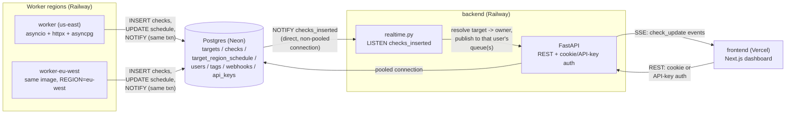
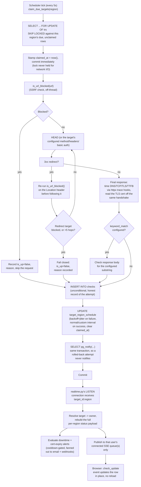

# Architecture

A map of how this system fits together: what runs where, how a check actually flows through
it end to end, and where each piece of code lives.

## System overview

Two independent worker regions check every target on their own schedule, writing to one shared
Postgres database. The backend reads that same database for ordinary requests, and separately
holds one long-lived `LISTEN` connection so it can push a check result to a connected browser
the instant it lands, over Server-Sent Events. The frontend never talks to Postgres or the
worker directly — everything goes through the backend's HTTP/SSE API.

Each worker region only ever reads and writes its own region's rows in
`target_region_schedule` — the two never contend with each other, and neither talks to the
other directly. They're connected only through the database and, from there, through what the
backend chooses to push out. See [`docs/adr/003-multi-region-coordination.md`](docs/adr/003-multi-region-coordination.md)
for the full reasoning behind that split.

Two separate database connections matter here for a reason that isn't obvious from the diagram
alone: ordinary app traffic goes through Neon's **pooled** connection, but the backend's single
`LISTEN` session needs Neon's **direct** (non-pooled) connection instead — a pooled connection's
underlying physical backend can be swapped between queries, so a `NOTIFY` sent while a different
backend happens to be attached is silently never delivered. See `backend/config.py`'s
`LISTEN_DATABASE_URL` and `backend/README.md` for the full story.

## Deployment targets

| Piece | Where | Notes |
|---|---|---|
| Frontend | Vercel | Next.js, builds from `frontend/` on every push to `main` |
| Backend API | Railway | One service, `backend/Dockerfile`, binds to Railway's injected `PORT` |
| Worker (region 1) | Railway | `worker/Dockerfile`, `REGION=us-east` |
| Worker (region 2) | Railway | Same image, `REGION=eu-west` — the only env var that differs between the two worker services |
| Database | Neon | Managed Postgres; pooled connection for app traffic, direct connection for the backend's `LISTEN` session and for Alembic migrations |
| Outgoing email | Resend | Downtime/recovery/cert-expiry alerts, password reset |

Every service reads its config from environment variables only — nothing is hardcoded per
environment. `ENVIRONMENT=production` on the backend forces `COOKIE_SECURE=True` and
`COOKIE_SAMESITE="none"` regardless of what those two variables are explicitly set to, since the
frontend and backend live on different origins in production and a misconfigured cookie would
silently break login rather than fail loudly.

## Request flow: a check happens

This is the core loop, end to end — from a worker deciding a target is due, through to a
browser's dashboard updating with no reload.

A few details that don't fit cleanly in the diagram:

- **Row-claiming never blocks.** `SKIP LOCKED` means a second worker instance in the same
  region hitting the same due row at the same moment simply doesn't see it and moves on to
  whatever else is due — no polling, no deadlock, no retry loop.
- **A crashed worker self-heals.** A claim older than 120 seconds is treated as abandoned and
  becomes claimable again, without any heartbeat or lease-renewal mechanism.
- **The redirect-SSRF check runs on every hop, not just the first request.** A target can pass
  validation at creation time and still redirect to a blocked address later (DNS rebinding, or
  a URL that starts safe and gets reconfigured upstream) — each `Location` header is
  independently re-checked before it's followed. If a target has custom headers or basic-auth
  credentials configured, those are dropped the moment a redirect crosses to a different host,
  so a secret never gets forwarded to a host the user never configured it for.
- **The check result is written before scheduling is decided.** `is_up=false` lands in `checks`
  unconditionally; backoff only changes when the *next* attempt happens, never whether this one
  was honestly recorded.
- **Alert evaluation can never block the push.** It runs inside its own `try/except` in the same
  handler that publishes the SSE event — a Resend outage or an unreachable webhook can only ever
  cost that one alert, never the real-time update itself.

## Component map

### `backend/`

| Module | What lives there |
|---|---|
| `routers/auth.py` | Register/login/logout/me, password change, alert preferences, account deletion (cascades to everything owned by the user), forgot/reset password |
| `routers/targets.py` | Target CRUD, request customization (method/headers/basic auth/keyword match), pause/resume, tag attach/detach, per-region status, check history (paginated for API-key callers), windowed analytics, CSV export, the SSE stream endpoint |
| `routers/tags.py` | Tag CRUD (create/rename/delete) |
| `routers/webhooks.py` | Webhook CRUD, including the alert-type/enabled toggles |
| `routers/api_keys.py` | API key issuance and revocation — cookie-auth only, deliberately never key-eligible itself |
| `realtime.py` | The `LISTEN` loop, per-user SSE pub/sub, and downtime/cert-expiry alert evaluation |
| `webhooks.py` | Signs and sends a webhook delivery (HMAC-SHA256, one attempt, SSRF-checked immediately before send) |
| `mail/` | A thin Resend wrapper plus plain-text email templates (alerts, password reset) |
| `security/ssrf.py`, `security/crypto.py` | The SSRF blocklist and the Fernet wrapper encrypting a target's basic-auth password at rest |
| `auth/` | Cookie session creation/verification (JWT), the API-key dependency factory, password hashing |
| `analytics.py` | Windowed uptime %, latency percentiles, and MTTR, shared with the CSV export's SLA/incident computation |
| `export.py` | Builds the compliance CSV (summary + incidents + raw check rows) |
| `models/` | SQLAlchemy models — one file per table |
| `alembic/` | Schema migrations, applied automatically on boot |

### `worker/`

| Module | What lives there |
|---|---|
| `main.py` | The scheduling loop: claim due targets for this region, check them concurrently (bounded by a semaphore), write results, reschedule, notify |
| `checker.py` | The actual HTTP check: method selection, manual redirect-following with per-hop SSRF revalidation, DNS/TCP/TLS/TTFB timing capture, TLS cert capture, keyword matching |
| `backoff.py` | The exponential-backoff-with-jitter curve used after a failed check |
| `retention.py` | A second, independent background task that prunes check rows older than the retention window |
| `ssrf.py`, `crypto.py` | The worker's own copies of the SSRF blocklist and the Fernet credential decryptor — deliberately duplicated from the backend's, not shared, since the two services are deployed independently |
| `config.py` | Environment-driven settings: region identity, check interval, timeout, retention window |

### `frontend/`

| Directory | What lives there |
|---|---|
| `app/` | Route pages — landing, auth, dashboard (list + per-target detail), settings |
| `components/` | The dashboard's own vocabulary: `signal-light.tsx`/`latency-gauge.tsx` (the two custom instrument components), `timing-waterfall.tsx`, `uptime-heatmap.tsx`, `incident-timeline.tsx`, `latency-chart.tsx`, plus the settings/webhook/API-key/tag management UI |
| `components/ui/` | Small shared primitives (button, input, dialog, switch, card) |
| `lib/api.ts` | The one place every request to the backend goes through |
| `lib/thresholds.ts`, `lib/status.ts` | The shared logic that classifies a check as up/degraded/down, kept in one place so the dashboard list and the detail page can't silently disagree |

All data fetching goes through `lib/api.ts`; no component calls `fetch` directly. Real-time
updates arrive over one `EventSource` connection per open dashboard tab, merged into the
existing in-memory list by target id — there is no client-side polling anywhere in this app.
