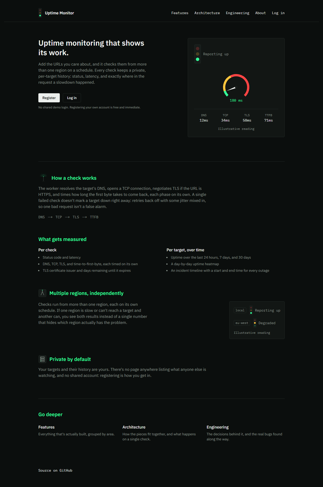
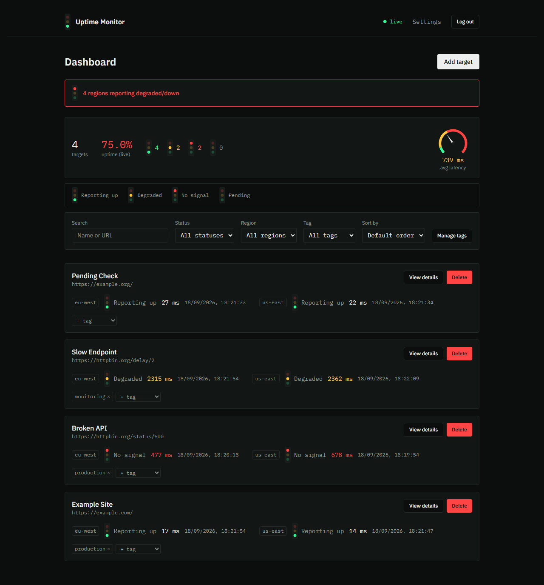
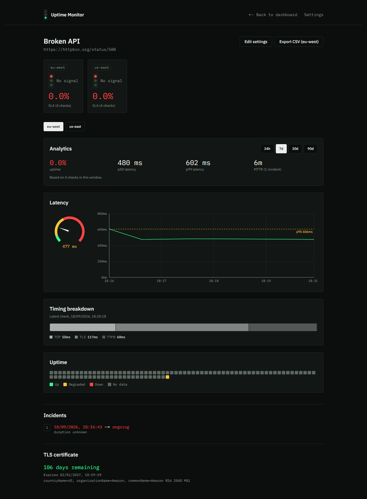
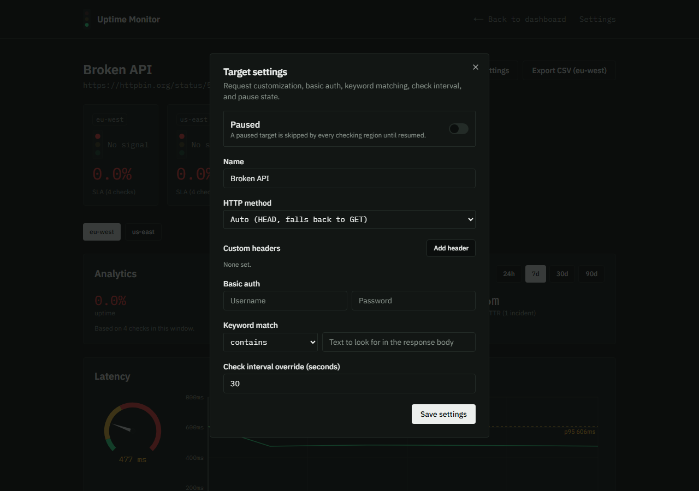
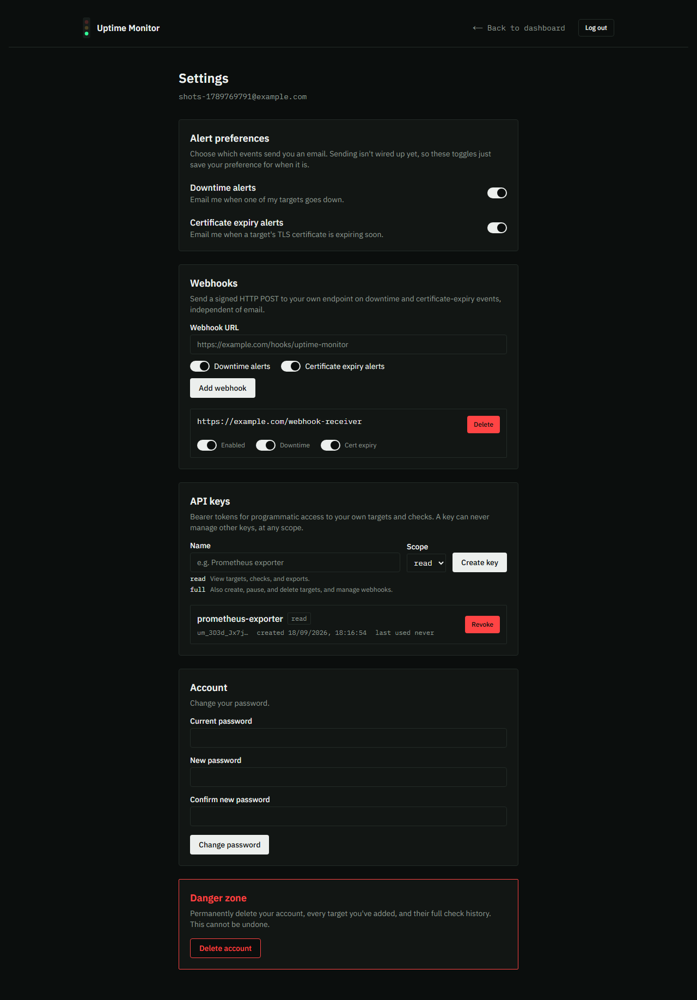

# Uptime Monitor



A personal uptime-monitoring platform that checks the URLs you care about from two independent
regions, breaks every check down into DNS, TCP, TLS, and time-to-first-byte instead of a single
response time, and keeps a private history per target: latency, TLS certificate expiry, uptime
percentage, and a real incident timeline. It's built around the infrastructure discipline a
tool like this actually needs if it's going to check a stranger's URLs safely: ownership
enforcement, SSRF defense at two checkpoints, signed webhook delivery, and scoped API keys,
alongside the networking depth that makes the checks themselves worth looking at.

See **[ARCHITECTURE.md](ARCHITECTURE.md)** for a system diagram and how the pieces fit together,
or **[CASE_STUDY.md](CASE_STUDY.md)** for the key technical decisions and why. The live site
has three more pages that go deeper than this README does: **/features** (everything that's
built, by area), **/architecture** (the same system diagram, browsable), and **/engineering**
(the decisions and the real bugs found along the way).

## Live Demo

**Frontend:** [uptime-monitor-atf-labs.vercel.app](https://uptime-monitor-atf-labs.vercel.app)
**Backend API:** [uptime-monitor-production-cff9.up.railway.app](https://uptime-monitor-production-cff9.up.railway.app) (interactive docs at `/docs`)

There's no shared or demo login. Registering your own account is free and takes a few seconds,
and every account only ever sees its own targets.

A note on cold starts, since it's a fair question for anything on free or hobby-tier hosting: a
real request to the live backend right now returned in under half a second, including one that
actually queries the database, so there's nothing to warn about in normal use. The one place a
delay could show up is Neon's own free-tier compute, which autosuspends after a period of no
activity and takes a moment to resume on the next query. That's a real, documented characteristic
of the hosting tier, not something measured directly in this session, since the database had
already been active from testing this exact deployment beforehand.

## Feature Walkthrough

### Dashboard



Every target, with each region's own status, latency, and last-checked time shown
independently, never collapsed into one number. The summary strip and legend at the top track
live counts by state; the filter bar searches by name or URL and narrows by status, region, or
tag; tag chips attach and detach right from the row.

### Target detail



Per-region SLA, a latency chart with a p95 line, a DNS/TCP/TLS/TTFB timing breakdown for the
most recent check, a day-by-day uptime heatmap, and an incident timeline built from real
consecutive-down runs, all switchable by region and by time window (24 hours, 7, 30, or 90
days).

### Configuring a target



A target isn't limited to "is this URL reachable." It can be checked with a specific HTTP
method, carry custom headers or HTTP Basic Auth (the password encrypted at rest), require or
forbid a keyword in the response body, run on its own check interval, or be paused entirely
without losing its history.

### Alerts, webhooks, and API keys



Downtime and certificate-expiry alerts go out by email and, independently, to any HMAC-signed
webhooks you configure. Scoped API keys give programmatic access to your own targets and checks
without reusing your session cookie, and a key can never be used to manage other keys, no
matter its own scope.

## Tech Stack

- **Frontend:** Next.js 14 (App Router), TypeScript, Tailwind CSS, Recharts
- **Backend:** FastAPI, async SQLAlchemy, Alembic migrations, slowapi rate limiting, Server-Sent
  Events for live push
- **Worker:** Python, asyncio, httpx, asyncpg, running continuously on its own schedule per
  region
- **Database:** PostgreSQL (Neon in production, Docker Compose Postgres locally, the same
  schema and migrations against both)
- **Email:** Resend, for downtime/cert-expiry alerts and password reset
- **Deployment:** Vercel (frontend), Railway (backend API and both worker regions), Neon
  (database)

## Running Locally

```bash
docker compose up -d
cd frontend && npm install && npm run dev
```

Two required secrets need generating first. Full step-by-step instructions, the complete
environment variable reference, and how to run the test suites are in **[SETUP.md](SETUP.md)**.

## Known Limitations

Stated plainly, the same way they're stated on the live site's own Engineering page:

- Built and priced for a personal tool, not a fleet. The rate limiter's counters live in one
  process's memory, and two regions is a deliberate, small number, not a ceiling being
  approached.
- Outgoing email uses the mail provider's shared sandbox sender, since no custom domain is
  verified yet, so delivery can land in spam.
- Compliance export is CSV only. PDF was designed for but never built.
- An alert that succeeds on one channel and fails on another isn't retried per channel. The
  system tracks whether a transition was alerted at all, not whether every channel confirmed
  delivery.
- There's no rotation story for a webhook's signing secret or an API key. Getting a new one
  means deleting and recreating it.
- A real load test against the live deployed backend found a genuine concurrency ceiling on
  Server-Sent Events connections, around 15 simultaneous connections per client. Full
  methodology and results are in **[docs/LOAD_TEST.md](docs/LOAD_TEST.md)**.
